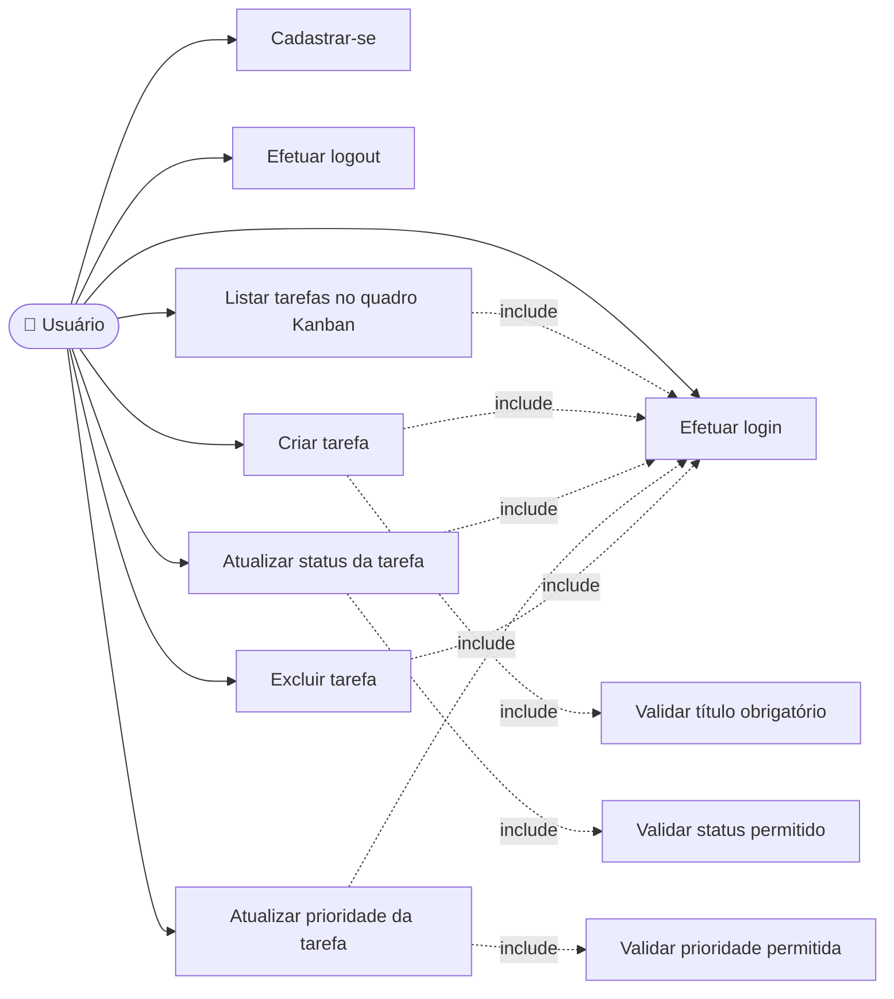

# Diagrama de Casos de Uso — TechFlow Task Manager

Ator único: **Usuário** (colaborador da equipe que usa o sistema para
gerenciar suas próprias tarefas).

## Descrição resumida dos casos de uso

| Caso de uso | Descrição |
|---|---|
| Cadastrar-se | Usuário cria uma conta informando usuário e senha; senha é armazenada com hash. |
| Efetuar login | Usuário autentica-se para acessar seu quadro de tarefas. |
| Efetuar logout | Usuário encerra a sessão autenticada. |
| Criar tarefa | Usuário adiciona uma nova tarefa (título obrigatório, descrição e prioridade opcionais). |
| Listar tarefas no quadro Kanban | Usuário visualiza suas tarefas organizadas nas colunas A Fazer / Em Progresso / Concluído, ordenadas por prioridade. |
| Atualizar status da tarefa | Usuário move a tarefa entre as colunas do quadro. |
| Atualizar prioridade da tarefa | Usuário reclassifica a tarefa entre baixa, média, alta ou crítica (funcionalidade adicionada na mudança de escopo). |
| Excluir tarefa | Usuário remove definitivamente uma tarefa. |

> Nota: para incluir este diagrama no documento da Parte Teórica (PDF/DOCX),
> renderize o bloco Mermaid acima em https://mermaid.live e exporte como
> imagem (PNG/SVG), ou tire um print da visualização do GitHub, que renderiza
> Mermaid nativamente em arquivos `.md`.
