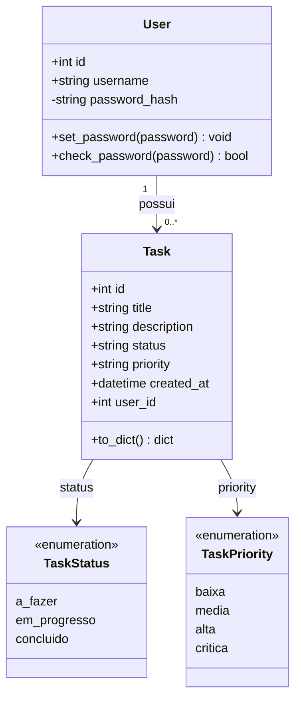

# Diagrama de Classes — TechFlow Task Manager

## Descrição das classes

- **User**: representa um usuário autenticado do sistema. A senha nunca é
  armazenada em texto puro — apenas seu hash (`password_hash`), gerado e
  validado através dos métodos `set_password` e `check_password`
  (Werkzeug `generate_password_hash` / `check_password_hash`).
- **Task**: representa uma tarefa pertencente a um usuário (`user_id`),
  contendo os campos `status` (posição no quadro Kanban) e `priority` — este
  último adicionado posteriormente como parte da mudança de escopo
  documentada no `README.md`.
- **TaskStatus / TaskPriority**: enumerações de valores válidos, aplicadas
  como validação nas camadas de rota (`src/routes/tasks.py`) antes de
  persistir qualquer alteração.

